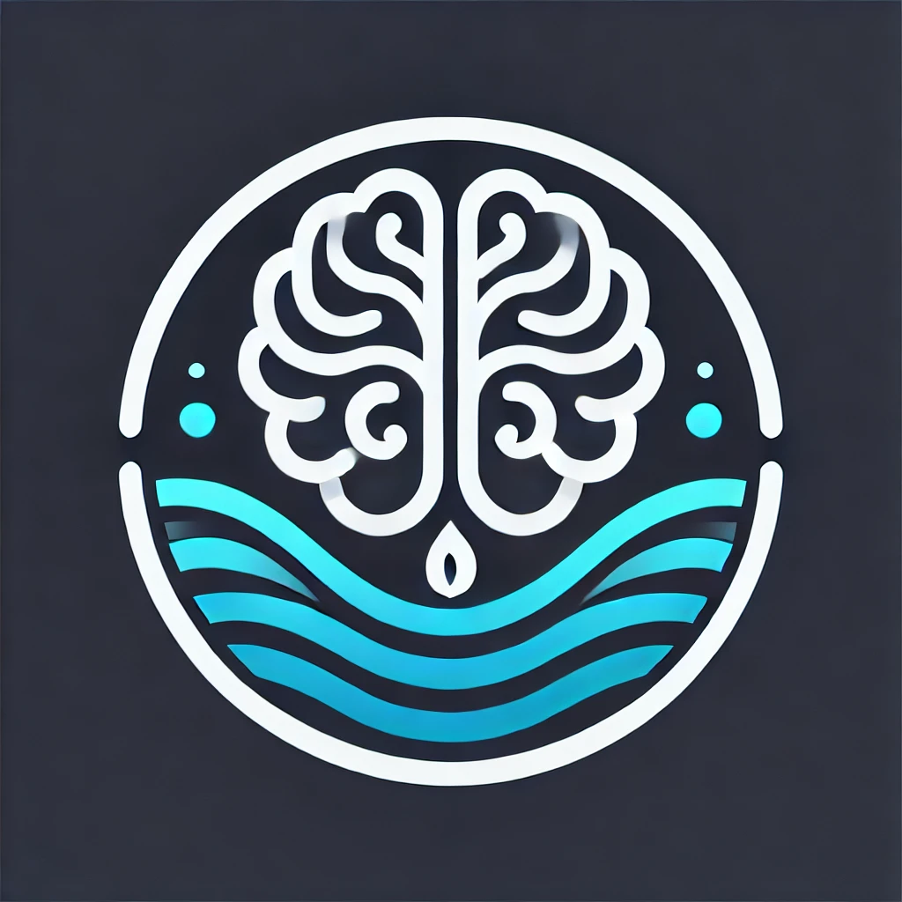

# DeepWork AI 🎯

> **Your armor in a world built to distract.**

AI-powered productivity application with real-time focus monitoring using computer vision. Built as a Final Year Project at Universiti Sains Malaysia that won Gold.



## 🌟 Features

- **🤖 Real-time Focus Detection** - YOLOv11n-cls model classifies 6 attention states
- **⏱️ Pomodoro Sessions** - 45-min work / 15-min break cycles with goal linking
- **📊 Analytics Dashboard** - Track focus percentage, distraction breakdown, trends
- **🎯 Goal Management** - Create, track, and link goals to study sessions
- **🔒 Privacy-First** - All AI processing happens on-device, no video uploaded

## 🧠 The DLEF Framework

**DeepLens Engine for Focus** - A 4-layer attention detection architecture:

```
Webcam → [L1: YOLOv11n-cls] → [L2: Gaze + EAR Validation] → [L3: 20/30 Rule] → [L4: Nudge]
```

| Layer | Component | Purpose |
|-------|-----------|---------|
| L1 | YOLOv11n-cls | Primary 6-class classification |
| L2 | MediaPipe | Gaze estimation + Eye Aspect Ratio |
| L3 | Temporal Heuristic | 20/30 rule - confirms sustained distraction |
| L4 | Response | Context-aware nudge messages |

## 📊 Model Performance

| Class | Accuracy | Priority |
|-------|----------|----------|
| Focused | 100% | Critical |
| Phone Usage | 100% | Critical |
| Absent | 100% | Critical |
| Drowsy | 94.3% | Secondary |
| Looking Away | 91.4% | Secondary |
| Bad Posture | 82.9% | Secondary |
| **Overall** | **94.76%** | - |

## 🛠️ Tech Stack

**Frontend:**
- Next.js 14 (React)
- Tailwind CSS
- Framer Motion
- Clerk Authentication

**Backend:**
- Flask (Python)
- PostgreSQL (Neon)
- Drizzle ORM

**AI/ML:**
- YOLOv11n-cls (Ultralytics)
- MediaPipe Face Mesh
- OpenCV

## 📁 Project Structure

```
deepwork-ai/
├── app/                 # Next.js pages and routes
├── backend/             # Flask API + DLEF model
│   ├── model/          # Trained YOLOv11 weights
│   ├── app.py          # Flask server
│   └── dlef.py         # Focus detection engine
├── components/          # React components
├── lib/                 # Database schemas
├── public/              # Static assets
└── utils/               # Helper functions
```

## 🚀 Getting Started

### Prerequisites
- Node.js 18+
- Python 3.10+
- Webcam

### Frontend Setup
```bash
npm install
npm run dev
```

### Backend Setup
```bash
cd backend
pip install -r requirements.txt
python app.py
```

Open [http://localhost:3000](http://localhost:3000)

## 🎥 Demo

🌐 **Live App:** [deep-work-ai-nu.vercel.app](https://deep-work-ai-nu.vercel.app)

> Note: AI focus detection requires local backend deployment due to webcam access and privacy-preserving on-device processing.

## 📄 Research Paper

This project is documented in an academic paper:

> **N. Aslam**, "DeepLens Engine for Focus: A Multi-Layered Deep Learning Framework for Real-Time Attention State Classification in Digital Productivity Environments," *arXiv preprint*, 2025.

## 🙏 Acknowledgments

- **Supervisor:** Dr. Tan Tien Ping, Universiti Sains Malaysia
- **Inspiration:** Cal Newport's "Deep Work", Anders Ericsson's "Peak"

## 📧 Contact

**Nafis Aslam**  
School of Computer Sciences, Universiti Sains Malaysia  
📩 nafisaslam18@student.usm.my

---

<p align="center">
  <i>Built with 💜 for the KAUST Master's Application 2025</i>
</p>
